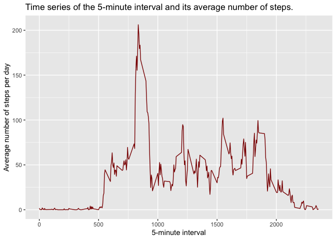
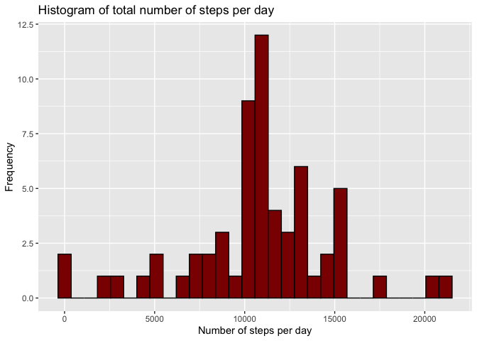
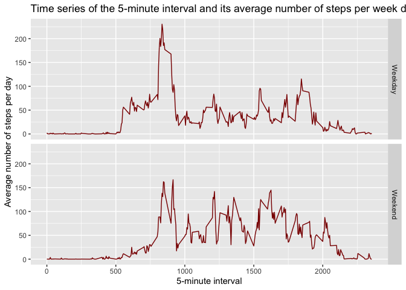

## Setting global knitr parameters to print 2 decimals.


```r
library(knitr)
options(scipen=1, digits=2)
```

## Loading and preprocessing the data


```r
library(dplyr)
```

```
## 
## Attaching package: 'dplyr'
```

```
## The following objects are masked from 'package:stats':
## 
##     filter, lag
```

```
## The following objects are masked from 'package:base':
## 
##     intersect, setdiff, setequal, union
```

```r
library(ggplot2)
act <- read.csv('activity.csv')
act$date <- as.Date(act$date, "%Y-%m-%d")
```

## What is mean total number of steps taken per day?

Grouping the data by day and summarizing using the sum function:


```r
act_grouped_day <- group_by(act, date)
act_steps_day <- summarise(act_grouped_day, steps_per_day = sum(steps, na.rm = FALSE))
```

### Histogram of number of steps per day.


```r
qplot(act_steps_day$steps_per_day, fill=I('darkred'), col=I('black'), main='Histogram of total number of steps per day', xlab='Number of steps per day', ylab = 'Frequency')
```

```
## `stat_bin()` using `bins = 30`. Pick better value with `binwidth`.
```

```
## Warning: Removed 8 rows containing non-finite values (stat_bin).
```

<!-- -->

The mean number of steps per day is 10766.19 and the median is 10765

## What is the average daily activity pattern?

Grouping the data by interval and summarizing using the mean function:


```r
act_interval_group <- group_by(act, interval)
act_interval_avg <- summarise(act_interval_group, average_steps = mean(steps, na.rm = TRUE))
with(act_interval_avg, qplot(interval, average_steps, col=I('darkred'), geom = "line", xlab = "5-minute interval", ylab = "Average number of steps per day", main = "Time series of the 5-minute interval and its average number of steps."))
```

<!-- -->

The 5-minute interval with the maximum average number of steps per day is 835

## Imputing missing values

There are 2304 missing values in the dataset, which represents 13.11% of the data.

I will use a straightforward method to impute the missing values, using the average 5-minute interval of each day.


```r
act_na_filled <- act
act_na_filled[act_na_filled$interval == act_interval_avg$interval & is.na(act_na_filled), ]$steps <- act_interval_avg$average_steps
```


```r
nafilled_grouped_day <- group_by(act_na_filled, date)
nafilled_steps_day <- summarise(nafilled_grouped_day, steps_per_day = sum(steps, na.rm = FALSE))
qplot(nafilled_steps_day$steps_per_day, fill=I('darkred'), col=I('black'), main='Histogram of total number of steps per day', xlab='Number of steps per day', ylab = 'Frequency')
```

```
## `stat_bin()` using `bins = 30`. Pick better value with `binwidth`.
```

<!-- -->

The mean number of steps per day with imputed missing values is 10766.19 and the median is 10766.19, almost the same as with the missing values.

## Are there differences in activity patterns between weekdays and weekends?


```r
act_na_filled$week_day <- sapply(act_na_filled$date, FUN = function(x) {if (weekdays(x) == 'Sunday' | weekdays(x) == 'Saturday') {'Weekend'} else {'Weekday'}})
act_na_filled$week_day <- factor(act_na_filled$week_day)
act_na_filled_interval_group <- group_by(act_na_filled, interval, week_day)
act_na_filled_int <- summarise(act_na_filled_interval_group, average_steps = mean(steps, na.rm = FALSE))
```

```
## `summarise()` has grouped output by 'interval'. You can override using the `.groups` argument.
```

Panel plot comparing the time series of the 5-minute interval between weekdays and wekkends.


```r
with(act_na_filled_int, qplot(interval, average_steps, facets=week_day ~ ., geom = "line", xlab = "5-minute interval",col=I('darkred'), ylab = "Average number of steps per day", main = "Time series of the 5-minute interval and its average number of steps per week day."))
```

<!-- -->

The maximum number of steps is lower at the weekends.
